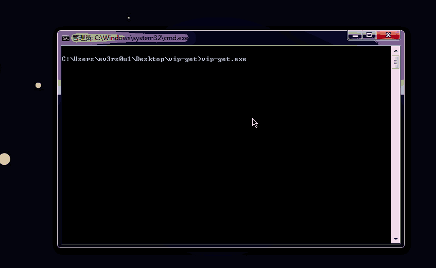

# vip-get
免费观看各大视频网站VIP资源的小脚本 (ง •̀_•́)ง

### 运行环境
* Ruby: 2.x
* Gem: nokogiri, terminal-table
* (如若没有可以下载 [Releases](https://github.com/ev3rs0u1/vip-get/releases) 版)

### 支持解析的网站
* 优酷
* 乐视
* 芒果
* 搜狐
* 爱奇艺
* 腾讯视频
* A站 & B站

## 截图

